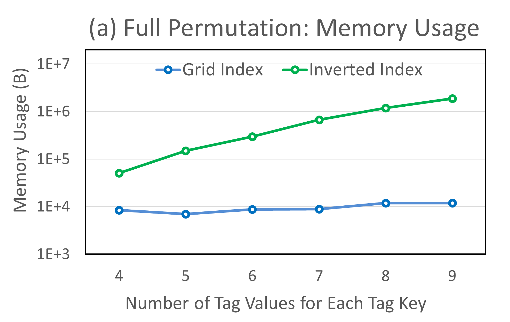
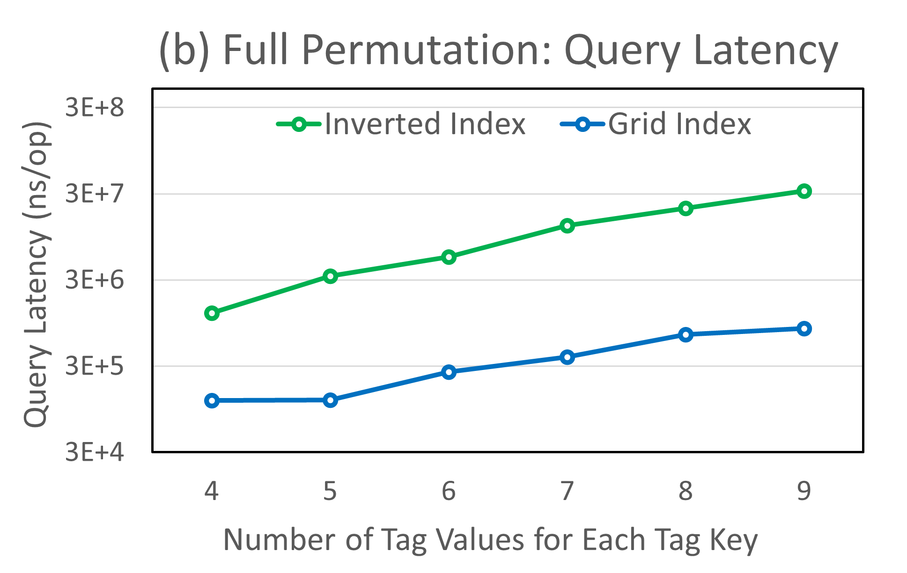

# Purpose
So far, this repo is create to build [Grid Index](./pkg/tsdb/index/tsi2). Reach package [here](./pkg/tsdb/index/tsi2/). Other codes are forked from InfluxDB.
# Grid Index
## Abstract
In some time-series databases, a form of an inverted index may be utilized for specific purposes, such as indexing and querying based on tag values or metadata associated with time-series data. This allows for efficient filtering and retrieval of time-series data based on specific tag values, enabling queries that involve filtering by tags.  
However, inverted index is a trade-off between storage usage and query performance. The posting list, a data structure to store record identifiers associated with each term in the index, will store redundant identifiers among different tag keys. Since time-series databases always deal with large-scale data in senarios like real-time monitoring and algorithmic trading, such storage overhead is extremely severe.  
In this project, the Grid Index is proposed to function the same as an inverted index with limited storage usage. The Grid Index takes multi-dimension index as hyperdimension space where identifiers of points represent records. 
## Method
In previous time-series databases, inverted index or other tag indexes are used to map tag values to a list of series identifiers. This is normally the first step to look up data. The Grid Index functions exactly the same.  
### Data Structure
A grid is a concept of multi-dimension space where each dimension represents a series of tag values for one tag key. The points inside the space are given ordered serial identifiers which are exactly the identifiers of time-series data. The grid will store the order of tag keys and the order of tag values, through which the identifiers of points can be accessed with calculation. It is worth noticing that it is actually unneccessary to store the space and identifiers and thus save storage. The Grid Index is consist of $N_{grid}$ grids.
### Get Series ID
This operation will return a list of identifiers of "hit series", which refer to series that at least contains the same tag keys and tag values as input. The lookup procedure in a single grid is simple. By mapping the input tag keys and tag values to dimensions and coordinate values, the index can position a part of space where identifiers within are wanted. Then for that sub-space, calculate identifiers of every points and return the list. This algorithm will iterate every grid and add hit identifiers to final returned list.
### Set Series Key
The purpose of this operation is to index an incoming series key, which is normally consist of tag pairs, and return the corresponding identifier. First, this algorithm will check if such series key has been indexed before. If so, there is no need to set again. If not, the algorithm will check if there is an existing grid able to contain the new series. Such grid should 1) have exactly same dimensions as the new series and 2) have free slot to append value in dimensions that lack coordinate value the same as tag value in new series. If algorithm finds one grid suitable, then append values to dimensions. This will activate pre-allocate space for identifiers. If not find any, the index will be expanded by opening up new grid and insert new seires there. The dimensions of newly created grid will be the same as incoming series, and the capacity for each dimension will be decided by an optimizer.

<!-- This algorithm can be expressed in pseudocode as the following.
>function SetSeriesKey(tagPairSet) -> (seriesID):
>>// check if the series has been indexed before  
>>for grid in index.grid:
>>>if grid.seriesKeyExist(tagPairSet) then
>>>>return grid.seriesID(tagPairSet)
>>>else -->

### Complexity Analysis
The main purpose of Grid Index is to optimize storage usage. So this chapter tries to compare spatial complexity between traditional inverted index and Grid Index.  
#### Upper Bound
Regarding the grid index as a compression optimization of invert index, the upper bound of compression ratio occurs when the tag values corresponding to all tag keys are fully arranged. In this case, the series keys are of full permutaion and no point in grids is wasted. Let there be $N$ tag keys, the $i_{th}$ tag key corresponds to $M_i$ tag values, and the average cost to store a tag value is $L$.  
- For traditional inverted index, for $i_{th}$ tag key, the size of posting list is $f(i)=\frac{\prod_{j=0}^{N-1}{M_j}}{M_i}$. The overall spatial complexity is $O(\sum_{i=0}^{N-1}f(i))$.  
- For Grid Index, let each dimension be pre-allocated with $K$ values, then each grid could contain $K^N$ series, and only take up $K \times N \times L$ memory, so the overall spatial complexity is $O(\frac{N \times \prod_{i=0}^{N-1}{M_i}}{K^{N-1}})$.
- The compression ratio is $\frac{L \times N}{K^{N-1} \times \sum_{i=0}^{N-1}M_i^{-1}}$. For a special case where $M_i=M | i \in [0,N-1]$, the compression ratio is $\frac{L \times M}{K^{N-1}}$.
#### Lower Bound
The lowest compression ratio occurs when every tag value only occurs once, which will lead to many voids in grids. Let there be $N$ tag keys, each tag key corresponds to $M$ tag values, and the average cost to store a tag value is $L$. In this case, only the identifiers on diagonal is valid. So the $i_{th} | i \in [0, M-1]$ series key should be like $[ TagKey_0: TagValue_{0,i}, TagKey_1: TagValue_{1,i}, … TagKey_{N-1}: TagValue_{N-1,i} ]$.
- For traditional inverted index, the overall spatial complexity is $O(M \times N)$.
- For Grid Index, the overall spatial complexity is $O(L \times M \times N)$.
- The compression ratio is $L$, revealing that even in worst case, the performance of Grid Index is close to that of traditional inverted index.

## Result
In this chapter, we compare Grid Index with traditional inverted index. We implement Grid Index in Golang 1.18 and perform our evaluation via single-threaded experiments on an Ubuntu Linux machine with Intel Core Xeon(R) Gold 6330 2.00GHz CPU. As for other experimental parameters, $N$ is equal to 3, $L$ is 1 byte, and $K$ will be decided by optimizer automatically.  
Figure (a) shows how memory usages of the two indexes change along with different number of tag values for each tag key. 
<!-- | Parameters | Value     |   |   |   |
|------------|-----------|---|---|---|
| N          | 3         |   |   |   |
| K          | Optimizer |   |   |   |
| L          | 1 byte    |   |   |   | -->

Figure (b) shows how the query latency changes. One operation in (b) refers to a batch of queries. The basic set up is shown in the table.

